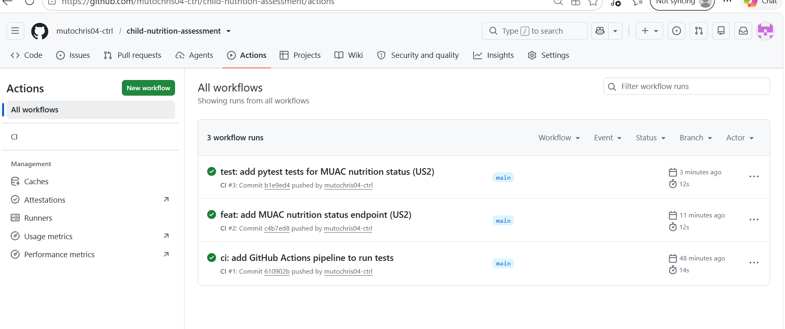
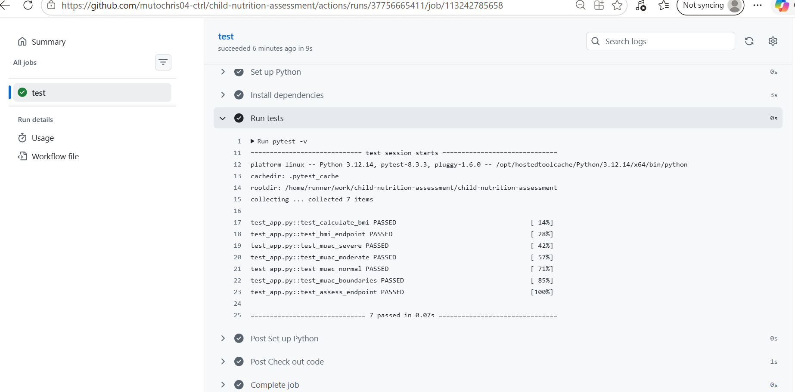
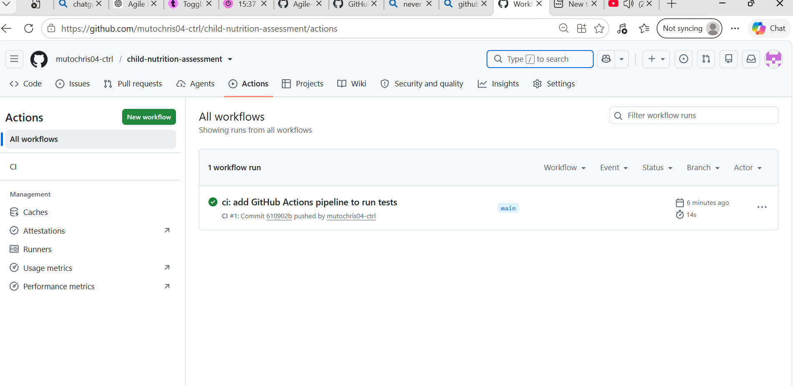

# Sprint 1 Review

## Sprint Goal
Deliver a working first version of the service that can calculate BMI and
classify nutrition status from MUAC, with automated tests running in a CI pipeline.

**Result: Goal achieved.**

## Completed Stories
| ID | Story | Points | Status |
|----|-------|--------|--------|
| US1 | BMI calculation from weight and height (`POST /bmi`) | 3 | Done |
| US2 | Nutrition status from MUAC (`POST /assess`) | 3 | Done |

**Velocity:** 6 story points completed out of 6 planned.

## Demo
**US1 – BMI**
- Request: `POST /bmi` with `{"weight_kg": 12, "height_cm": 85}`
- Response: `{"bmi": 16.6}`

**US2 – MUAC nutrition status**
- Request: `POST /assess` with `{"muac_cm": 11.0}`
- Response: `{"muac_cm": 11.0, "status": "Severe Acute Malnutrition"}`

## Definition of Done Check
| DoD item | Status |
|----------|--------|
| Code pushed to main | Yes |
| Acceptance criteria met | Yes (BMI 16.6 example, WHO MUAC cut-offs) |
| Automated pytest tests written | Yes (7 tests) |
| All tests pass in GitHub Actions CI | Yes (green) |
| Code readable with comments | Yes |
| README updated | Partly - run instructions still missing (moved to Sprint 2) |

## Evidence
**All Sprint 1 CI runs passed**

**7 tests passed in CI**

**First CI pipeline run**

